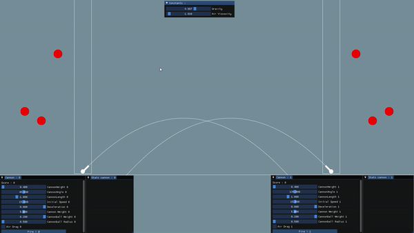

# Project Cannon

**Group :DEVINE Vincent, GOUPIL Kristian and LISE Omaya**

For ISART Digital

 

## **Project description :**
We created a smalll cannon game with OpenGL and ImGUI as wll as our own math functions. The aim was to work on physics concepts such as trajectory calculation or air resistance. All variables used for our calculation can be modified and informations (such as prediction) can be seen on the bottom of the screen.

## **To build and run the project :** 
Use the build (launch the .exe) or open the Visual Studio.
 

## **Step 1 & 2:**
Variables used: 
 
- We calculated the trajectory of of a cannonball launched at a modifiable speed from a modifiable angle from a cannon (both have weights). 
 
## **Step 3 :** 
- We checked if our previous calculations were correct with a prediction on our trajectory. 
 
## **Step 4 :**
- We added the decceleration in our calculations (predicted from the lenght of the cannon).
 
## **Step 5 :**
- We added air resistance in our calculations.
 
## **Step 6 & 7:**
- We made a basic cannon game with two players and movable targets to shoot at to gain points.

## Hardest Part :
- Calculate the air resistance

System : Windows